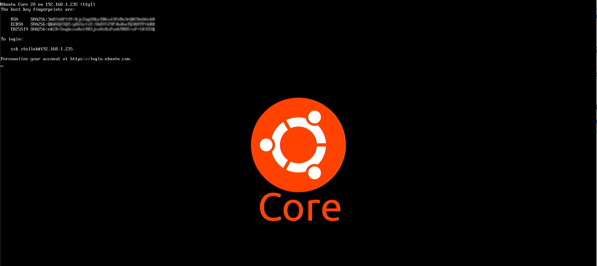

# uc-go-splash
simple splash screen for uc with go

Inspired by https://github.com/xdsopl/framebuffer

That repository was using src/framebuffer in the old pre-modules era

So I moved it to vendor/ directory to be able to build

And I also added a simple Makefile to build for both arm64 and amd64 

## Prerequisities

- Linux PC or SBC
- GO must be installed and $GOPATH must be set correctly

## Building

run ```make```

## Usage

```
sudo ucsp-amd64 /path/to/your_png_file.png
sudo ucsp-arm64 /path/to/your_png_file.png
```

## Screenshot

